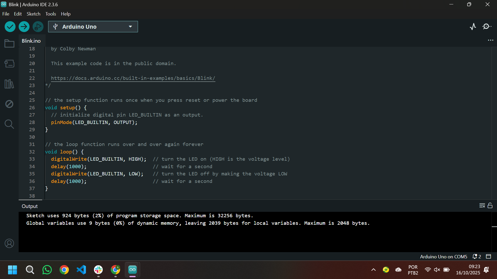
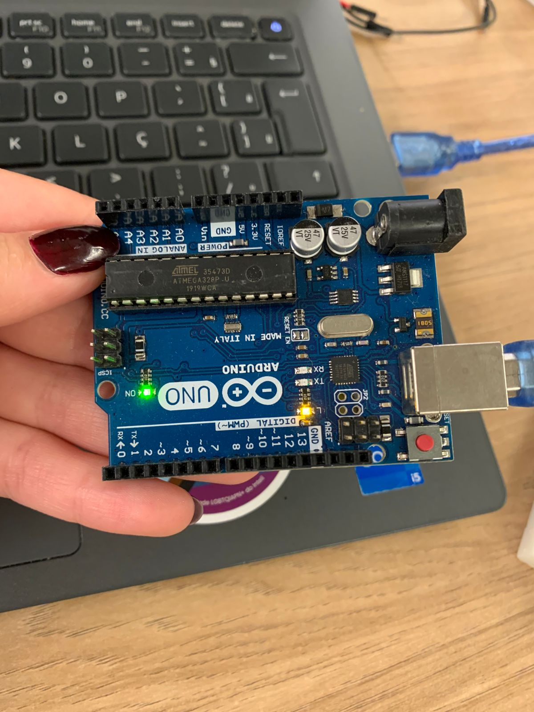
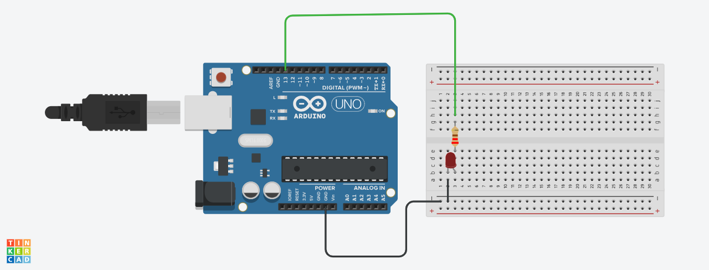
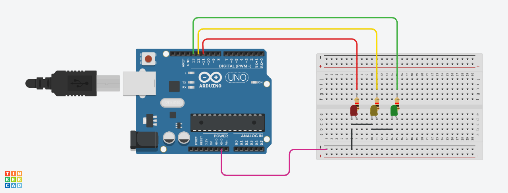

# Parte 1: Blink Led Interno

## Tela com IDE e código

<div align="center">
<p align="center">
</a>
</p>
</div>

## Led interno funcionando

<div align="center">
<p align="center">
</a>
</p>
</div>

## <b>Link para vídeo demonstrativo:</b> <a href="https://drive.google.com/file/d/1lfK1P33ks00X08LBHDZM6BJshDJl9sDf/view?usp=drivesdk">Acesse o vídeo demonstrativo</a>

# Parte 2: Simulando Blink Externo

## Simulação no TinkerCad

<div align="center">
<p align="center">
</a>
</p>
</div>

## Código do Blink

```c++
void setup()
{
  pinMode(13, OUTPUT);
}

void loop()
{
  digitalWrite(13, HIGH);
  delay(1000); // Espera por 1
  digitalWrite(13, LOW);
  delay(1000); // Espera por 1s
}
```

## <b>Link para TinkerCad:</b> <a href="https://www.tinkercad.com/things/84rzKlxhvwC-sizzling-juttuli/editel?returnTo=https%3A%2F%2Fwww.tinkercad.com%2Fdashboard&sharecode=Z5fZBRkU5h6hcYRzIEH2JJlxbFn6vj1xQvoYILiP75M">Acesse a simulação no TinkerCad</a>

## <b>Link para vídeo demonstrativo:</b> <a href="https://drive.google.com/file/d/1kZKqj1HO49sSJd-AHAKQmmg4TnxccmMo/view?usp=sharing">Acesse o vídeo demonstrativo</a>

## Simulação no TinkerCad - Mini semáforo

<div align="center">
<p align="center">
</a>
</p>
</div>

## Código do Blink

```c++
void setup()
{
  pinMode(11, OUTPUT);
  pinMode(12, OUTPUT);
  pinMode(13, OUTPUT);
}

void loop()
{
  digitalWrite(11, HIGH);
  delay(1000); // Espera 1s
  digitalWrite(11, LOW);
  delay(1000); // Espera 1s
  digitalWrite(12, HIGH);
  delay(1000);
  digitalWrite(12, LOW);
  delay(1000);
  digitalWrite(13, HIGH);
  delay(1000);
  digitalWrite(13,LOW);
  delay(1000);
}
```

## <b>Link para TinkerCad:</b> <a href="https://www.tinkercad.com/things/ijWSfd6aNIO/editel?returnTo=%2Fdashboard%2Fdesigns%2Fcircuits&sharecode=7EaPR_oYpVu8YkqlnN5PVJh-ani94BdbXDQ65trccHA">Acesse a simulação no TinkerCad</a>

## <b>Link para vídeo demonstrativo:</b> <a href="https://drive.google.com/file/d/1-rLDBiPOltubFp6b0mixgnXhLx5AlfOE/view?usp=sharing">Acesse o vídeo demonstrativo</a>