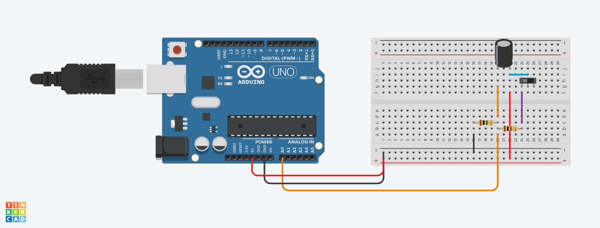
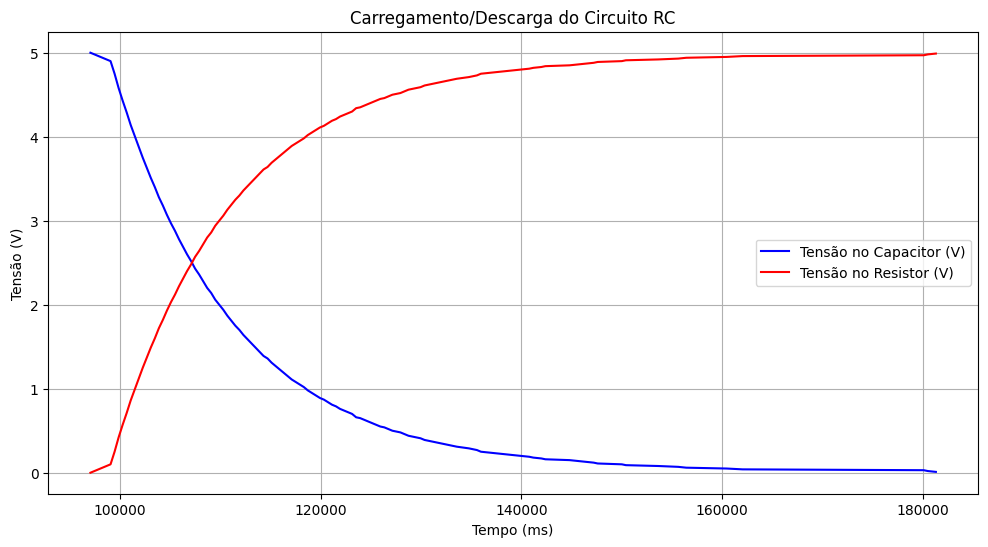

# Circuito RC / Prática

&ensp;Durante a aula foi montado o seguinte circuito:

<div align="center">
<p align="center">
</a>
</p>
</div>

&ensp;Com esse circuito, adicionamos o seguinte código:

```c++
int pinoNoRC=0; 
int valorLido = 0;
float tensaoCapacitor = 0, tensaoResistor;
unsigned long time; 
void setup(){ 
Serial.begin(9600); 
} 
void loop() { 
	time=millis(); 
	valorLido=analogRead(pinoNoRC); 
	tensaoResistor=(valorLido*5.0/1023); // 5.0V / 1023 degraus = 0.0048876 
	tensaoCapacitor = abs(5.0-tensaoResistor);
 	Serial.print(time); //imprime o conteúdo de time no MONITOR SERIAL
    Serial.print(" "); 
  	Serial.print(tensaoResistor);
  	Serial.print(" ");
  	Serial.println(tensaoCapacitor); 
	delay(400); 
}
```

&ensp;Ao simularmos o circuito, o resultado foi de uma variação de tesão no capacitor. A partir dos dados de tempo e tensão gerados, é possível utilizá-los para pltar um gráfico com python e a biblioteca matplotlib.

## <b>Link para vídeo demonstrativo no TinkerCad:</b> <a href="https://drive.google.com/file/d/1Y8z4klBf_SaiXCxSQUPcCxpKhNtc5dcE/view?usp=sharing">Acesse o vídeo demonstrativo</a>

## <b>Link para vídeo demonstrativo da montagem física:</b> <a href="https://drive.google.com/file/d/1WB0_RdALJpGc7Ge7sFs2awLtANLDX-AV/view?usp=sharing">Acesse o vídeo demonstrativo</a>


### O gráfico formado:

<div align="center">
<p align="center">
</a>
</p>
</div>

### O código utilizado, com os dados coletados:

````python
import matplotlib.pyplot as plt

# Dados copiados do Monitor Serial
dados = [
    (97058, 5.00, 0.00),
    (99063, 4.90, 0.10),
    (99465, 4.75, 0.25),
    (99865, 4.58, 0.42),
    (100267, 4.43, 0.57),
    (100668, 4.29, 0.71),
    (101069, 4.14, 0.86),
    (101470, 4.01, 0.99),
    (101871, 3.88, 1.12),
    (102273, 3.75, 1.25),
    (102674, 3.63, 1.37),
    (103074, 3.51, 1.49),
    (103476, 3.40, 1.60),
    (103877, 3.28, 1.72),
    (104278, 3.18, 1.82),
    (104679, 3.07, 1.93),
    (105080, 2.97, 2.03),
    (105482, 2.88, 2.12),
    (105882, 2.78, 2.22),
    (106284, 2.69, 2.31),
    (106685, 2.60, 2.40),
    (107086, 2.52, 2.48),
    (107487, 2.43, 2.57),
    (107888, 2.36, 2.64),
    (108290, 2.28, 2.72),
    (108691, 2.20, 2.80),
    (109091, 2.14, 2.86),
    (109493, 2.06, 2.94),
    (109894, 2.00, 3.00),
    (110296, 1.94, 3.06),
    (110696, 1.87, 3.13),
    (111097, 1.81, 3.19),
    (111499, 1.75, 3.25),
    (111900, 1.70, 3.30),
    (112301, 1.64, 3.36),
    (112702, 1.59, 3.41),
    (113103, 1.54, 3.46),
    (113505, 1.49, 3.51),
    (113905, 1.44, 3.56),
    (114307, 1.39, 3.61),
    (114708, 1.36, 3.64),
    (115109, 1.31, 3.69),
    (115510, 1.27, 3.73),
    (115911, 1.23, 3.77),
    (116313, 1.19, 3.81),
    (116714, 1.15, 3.85),
    (117114, 1.11, 3.89),
    (117516, 1.08, 3.92),
    (117917, 1.05, 3.95),
    (118319, 1.02, 3.98),
    (118719, 0.98, 4.02),
    (119120, 0.95, 4.05),
    (119522, 0.92, 4.08),
    (119923, 0.89, 4.11),
    (120324, 0.87, 4.13),
    (120725, 0.84, 4.16),
    (121126, 0.81, 4.19),
    (121527, 0.79, 4.21),
    (121928, 0.76, 4.24),
    (122330, 0.74, 4.26),
    (122731, 0.72, 4.28),
    (123131, 0.70, 4.30),
    (123533, 0.66, 4.34),
    (123934, 0.65, 4.35),
    (124336, 0.63, 4.37),
    (124736, 0.61, 4.39),
    (125137, 0.59, 4.41),
    (125539, 0.57, 4.43),
    (125940, 0.55, 4.45),
    (126341, 0.54, 4.46),
    (126742, 0.52, 4.48),
    (127143, 0.50, 4.50),
    (127545, 0.49, 4.51),
    (127945, 0.48, 4.52),
    (128347, 0.46, 4.54),
    (128748, 0.44, 4.56),
    (129149, 0.43, 4.57),
    (129550, 0.42, 4.58),
    (129951, 0.41, 4.59),
    (130353, 0.39, 4.61),
    (132358, 0.34, 4.66),
    (132759, 0.33, 4.67),
    (133160, 0.32, 4.68),
    (133562, 0.31, 4.69),
    (134765, 0.29, 4.71),
    (135166, 0.28, 4.72),
    (135567, 0.27, 4.73),
    (135968, 0.25, 4.75),
    (136771, 0.24, 4.76),
    (139177, 0.21, 4.79),
    (139980, 0.20, 4.80),
    (140782, 0.19, 4.81),
    (141184, 0.18, 4.82),
    (141985, 0.17, 4.83),
    (142387, 0.16, 4.84),
    (144793, 0.15, 4.85),
    (145596, 0.14, 4.86),
    (146398, 0.13, 4.87),
    (147201, 0.12, 4.88),
    (147602, 0.11, 4.89),
    (150008, 0.10, 4.90),
    (150410, 0.09, 4.91),
    (153619, 0.08, 4.92),
    (155624, 0.07, 4.93),
    (156427, 0.06, 4.94),
    (160438, 0.05, 4.95),
    (162042, 0.04, 4.96),
    (180093, 0.03, 4.97),
    (180495, 0.02, 4.98),
    (181297, 0.01, 4.99),
]

# Separando as colunas
x = [item[0] for item in dados]
y1 = [item[1] for item in dados]
y2 = [item[2] for item in dados]

# Plotando o gráfico
plt.figure(figsize=(12, 6))
plt.plot(x, y1, label='Tensão no Capacitor (V)', color='blue')
plt.plot(x, y2, label='Tensão no Resistor (V)', color='red')
plt.xlabel('Tempo (ms)')
plt.ylabel('Tensão (V)')
plt.title('Carregamento/Descarga do Circuito RC')
plt.legend()
plt.grid(True)
plt.show()
```