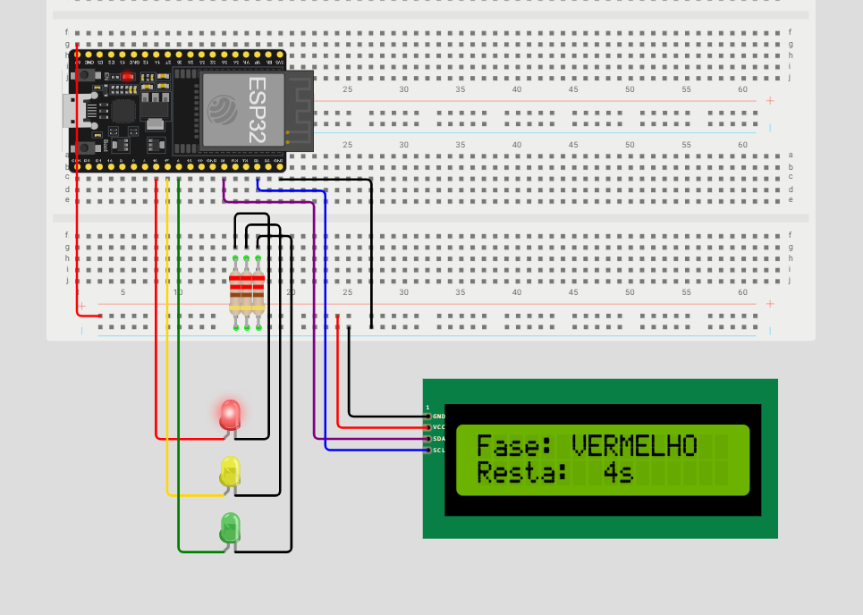
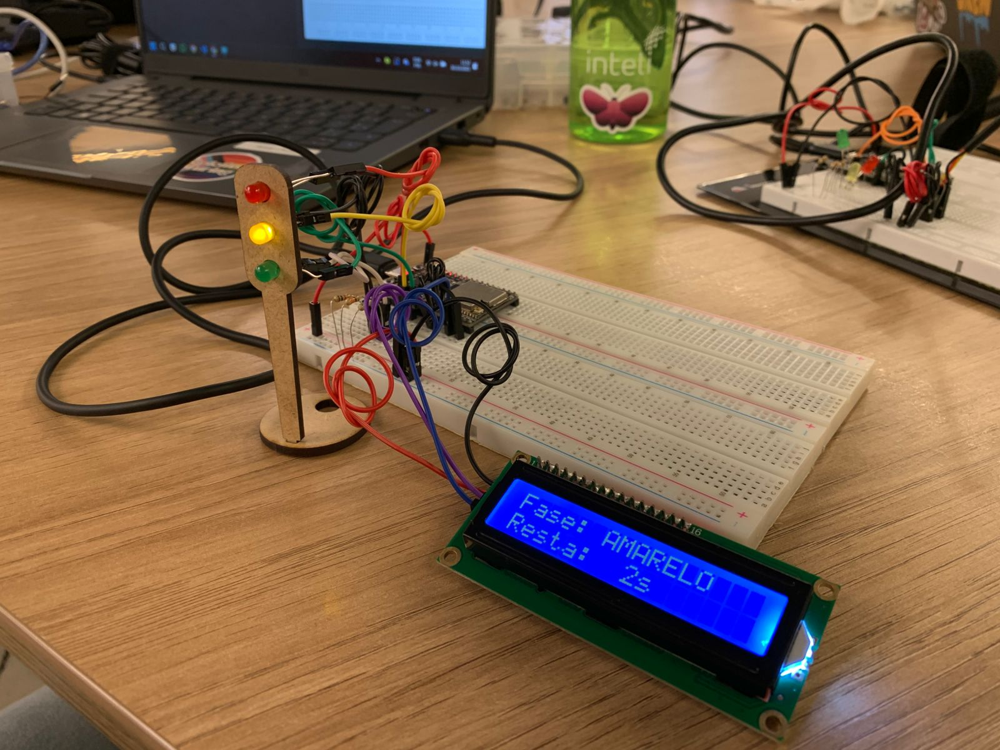
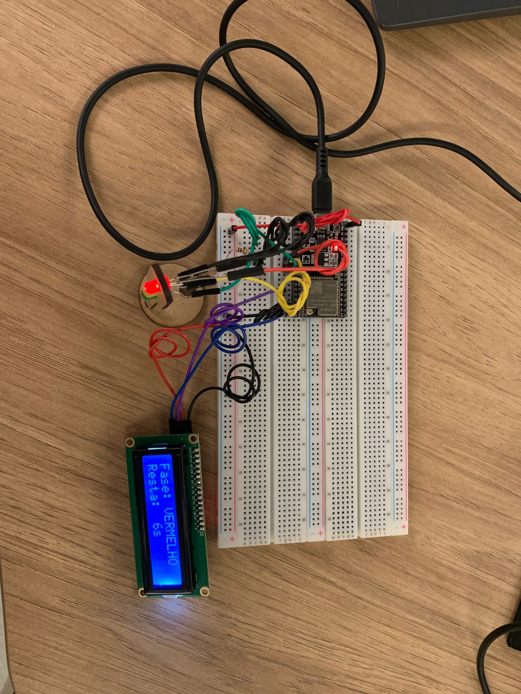

# Semáforo Offline

A atividade proposta é a montagem de um semáforo físico, utilizando materiais como uma protoboard, microcontroladores, LEDs, etc. A partir disso, o código de lógica deve ser montado em C++, controlando seu funcionamento de forma correta.

## Parte 1: Montagem Física do Semáforo

### Tabela de elementos físicos utilizados

| Item                | Quantidade | Descrição breve                        |
|---------------------|-----------:|----------------------------------------|
| LED vermelho        | 1          | LED 5mm vermelho    |
| LED amarelo         | 1          | LED 5mm amarelo                         |
| LED verde           | 1          | LED 5mm verde                           |
| Resistor            | 3          | Resistores para limitar corrente dos LEDs |
| ESP32 (DevKit)      | 1          | Placa ESP32           |
| Display LCD         | 1          | Display LCD para visualização do tempo restante |
| Suporte em MDF      | 1          | Placa de MDF para montagem física do semáforo |

### Esquema On-line no Simulador Wokwi

<div align="center">
<p align="center">
</a>
</p>
</div>

### Circuito Físico Montado

<div align="center">
<p align="center">
</a>
</p>
</div>

<div align="center">
<p align="center">
</a>
</p>
</div>

## <b>Link para vídeo demonstrativo da montagem física:</b> <a href="https://drive.google.com/file/d/1tJZ1X0_4pa23hJPaREQMltqeI2RMtPx_/view?usp=sharing">Acesse o vídeo demonstrativo</a>

## Parte 2: Programação e Lógica do Semáforo

O código de lógica do semáforo e do seu visor pode ser encontrado aqui: [semaforo_offline.cpp](../Semana%2003/src/semaforo_offline.cpp)

O código utilizado foi o seguinte:

```c++
#include <LiquidCrystal_I2C.h> // Biblioteca para display LCD

// Pinos dos LEDs do semáforo
const int ledVermelho = 16;
const int ledAmarelo  = 17;
const int ledVerde    = 5;

// Tempos de cada fase em segundos
const int tempoVermelho = 6;
const int tempoVerde    = 4;
const int tempoAmarelo  = 2;

LiquidCrystal_I2C lcd(0x27, 16, 2);

void setup() {
  // Configura os pinos dos LEDs como saída
  pinMode(ledVermelho, OUTPUT);
  pinMode(ledAmarelo, OUTPUT);
  pinMode(ledVerde, OUTPUT);
  
  // Inicializa o LCD
  lcd.init();
  lcd.backlight();
  
  // Mensagem inicial
  lcd.clear();
  lcd.print("Semaforo Offline");
  lcd.setCursor(0, 1);
  lcd.print("Iniciando...");
  delay(2000);
}

// Gerencia uma fase do semáforo
// - ledPin: ponteiro para o pino do LED ativo
// - nomeCor: ponteiro para o texto exibido no LCD
// - duracaoSegundos: ponteiro para o tempo de duração
void gerenciarFase(const int* ledPin, const char* nomeCor, const int* duracaoSegundos) {

  // Liga apenas o LED correspondente e desliga os outros
  digitalWrite(ledVermelho, (*ledPin == ledVermelho) ? HIGH : LOW);
  digitalWrite(ledAmarelo,  (*ledPin == ledAmarelo)  ? HIGH : LOW);
  digitalWrite(ledVerde,    (*ledPin == ledVerde)    ? HIGH : LOW);
  
  // Atualiza cabeçalho do LCD 
  lcd.clear();
  lcd.print("Fase: ");
  lcd.print(nomeCor);
  
  // Contagem regressiva do LCD
  for (int i = *duracaoSegundos; i > 0; i--) {
    lcd.setCursor(0, 1); 
    lcd.print("Resta: ");
    
    if (i < 10) {
      lcd.print(" ");
    }
    
    lcd.print(i);
    lcd.print("s ");
    
    delay(1000);
  }
}

void loop() {
  const int* pVerde    = &ledVerde;
  const int* pAmarelo  = &ledAmarelo;
  const int* pVermelho = &ledVermelho;
  
  const int* tVerde    = &tempoVerde;
  const int* tAmarelo  = &tempoAmarelo;
  const int* tVermelho = &tempoVermelho;

  // Loop de funcionamento do semáforo
  gerenciarFase(pVerde,    "VERDE",    tVerde);
  gerenciarFase(pAmarelo,  "AMARELO",  tAmarelo);
  gerenciarFase(pVermelho, "VERMELHO", tVermelho);
}
```

## Parte 3: Avaliação de Pares

### Feedback 1 - Tobias Viana Araújo

"Anny, o seu protótipo está muito bem estruturado. Não encontrei nenhum tipo de erro no código, onde todos os requisitos foram respondidos e gostei bastante do LCD que foi implementado, mostrando em quanto tempo exato vai ser mudada as cores nos semáforos.

Ponto de Atenção: Os fios estão enrolados e isso pode danificá-los."

Nota final: 10.0

### Feedback 2 - Pedro Siqueira

"O circuito está completo e funcionando perfeitamente. O código está organizado e bem estruturado. 
Ponto forte: o código tem comentários que ajudam a compreensão.

Parabéns Anny, muito bom!!"

Nota Final: 10.0
